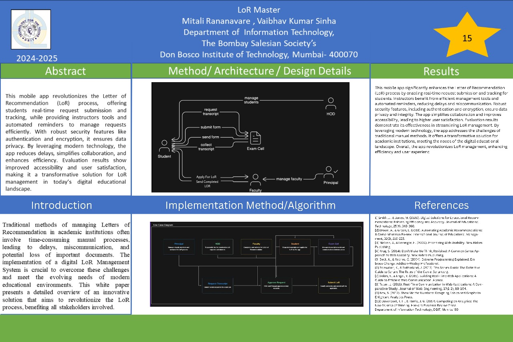

# major_project

A new Flutter project.

## Getting Started

This project is a starting point for a Flutter application.

A few resources to get you started if this is your first Flutter project:

- [Lab: Write your first Flutter app](https://docs.flutter.dev/get-started/codelab)
- [Cookbook: Useful Flutter samples](https://docs.flutter.dev/cookbook)

For help getting started with Flutter development, view the
[online documentation](https://docs.flutter.dev/), which offers tutorials,
samples, guidance on mobile development, and a full API reference.
# 📱 major_project – LoR Automation App

A mobile application that streamlines and secures the Letter of Recommendation (LoR) process, enhancing efficiency and accessibility for students and instructors.

## 🚀 Getting Started

This project is built with Flutter and serves as a starting point for mobile development.

### 📚 Helpful Resources
- [Lab: Write your first Flutter app](https://docs.flutter.dev/get-started/codelab)
- [Cookbook: Useful Flutter samples](https://docs.flutter.dev/cookbook)
- [Flutter Documentation](https://docs.flutter.dev/)

## 📄 Project Documents

- [📘 Final Report](BE_Project_Report_2020_SEM8.pdf)
- [📊 Presentation Slides](New%20Microsoft%20PowerPoint%20Presentation.pptx)
- 

## 🔐 Features

- Student-side request submission and real-time tracking
- Instructor-side request management with automated reminders
- Secure authentication and encrypted data handling
- Improved communication and reduced delays compared to traditional LoR workflows

## 🛠️ Tech Stack

- **Frontend**: Flutter
- **Backend**: Firebase (or your chosen backend)
- **Security**: OAuth, encryption protocols
